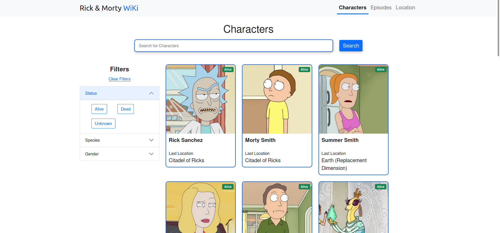
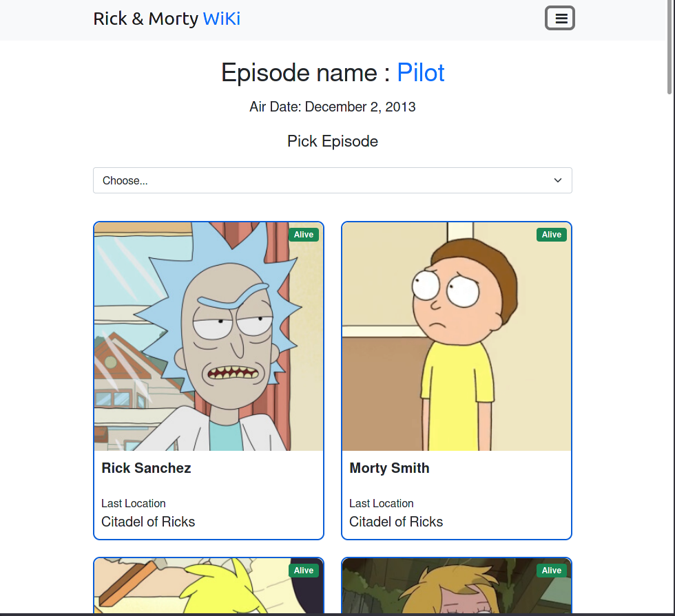
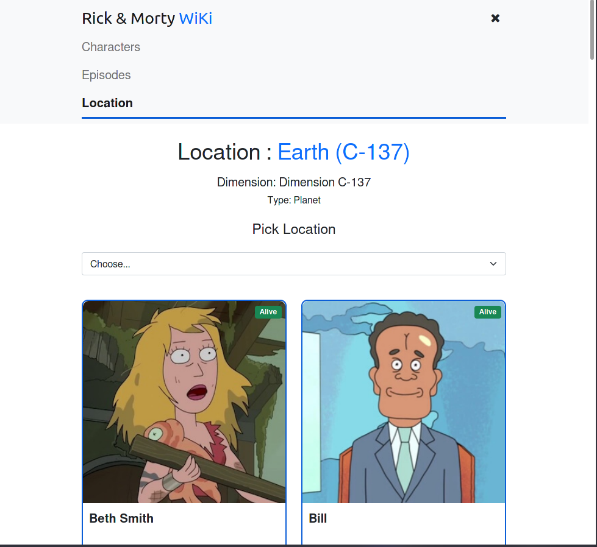

# Rick and Morty WiKi
 
 This project is a Rick and Morty character WiKi created using React.

 ---

 The topics covered in this project were:

* React Hooks
* React Components
* Fetch API
* Bootstrap
* Pagination
* Search Bar
* Data Filtering
* Dynamic Routing

---

    
    

